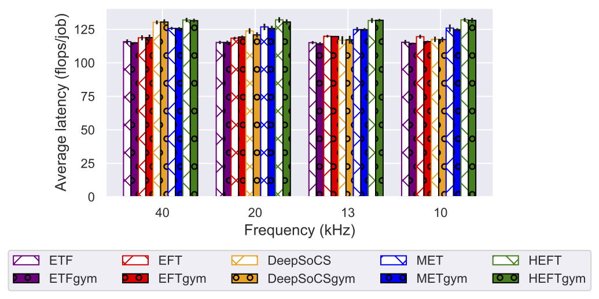

# DS3Gym Framework

The DS3Gym framework is a system-level domain specific system-on-chip simulation environment, 
that enables to train and test deep reinforcement learning based schedulers in a high-fidelity SoC scheduling environment.
This environment is based on [DS3 framework](https://arxiv.org/pdf/2003.09016.pdf) and its original [development](https://github.com/segemena/DS3).

This repository re-implements and modifies the standard DS3 simulator into a Gym environment to provide a RL-friendly framework for task scheduling on SoC level. To best of our knowledge, this is one of a very few system-level task scheduling environment that is RL friendly.


## Usage

<b>Requirements</b>
* CPU or NVIDIA GPU, Linux, Python 3.6+
* PyTorch, TensorFlow, Python packages; instructions for installing dependencies are followed.

1. Python environment: We recommend using Conda package manager

```bash
conda create -n ds3gym python=3.6
conda activate ds3gym
```

2. Install DS3Gym framework and required Python dependencies

```bash
git clone https://github.com/anonymous1958342/DS3Gym
cd DS3Gym
pip install -e .
pip install simpy networkx gym numpy matplotlib
```

1. To run deep reinforcement learning based schedulers, install additional packages. DeepSoCS requires [TensorFlow](https://www.tensorflow.org/). For computation efficiency, we recommend installing a distributed computing package, [Ray](https://ray.io/).

```bash
pip install ray==1.3.0 tensorflow==1.15.0
```


## DS3Gym Usage

<div align="center">
  
  <figcaption><b><br>Figure 1: Overview of the standard DS3 framework workflow.</b></figcaption>
</div>

<div align="center">
  
  <figcaption><b><br>Figure 2: A simple job and resource profiles.</b></figcaption>
</div>

DS3Gym executes with [pseudo-steady-state](https://arxiv.org/abs/2005.07666) condition. The framework provides heuristics (rule-based) schedulers and reinforcement learning based schedulers to evaluate the environment.

<div align="center">
  
  <figcaption><b><br>Figure 3: A mechanism of pseudo-steady-state that approximates steady-scheduling condition.</b></figcaption>
</div>

<div align="center">
  
  <figcaption><b><br>Figure 4: An evaluation of run-time performances comparing DS3Gym with standard DS3 framework.</b></figcaption>
</div>


### User customization

A DS3Gym framework allows users to customize different configurations. The supported settings are listed in `config.py`:

* `--resource_profile`: A list of resource profiles
* `--job_profile`: A list of job profiles
* `--scale`: Job frequency (lower scale for fast injection rate)
* `--simulation_length`: A total simulation length for one running episode
* `--scheduler_name`: A name of scheduler (ETF/MET/STF/HEFT/random/DeepSoCS)
* `--max_num_jobs`: A length of job queue
* `--run_mode`: A choice of mode in simulation execution (`run` for standard DS3 framework / `step` for DS3Gym framework)
* `--pss`: A choice of mode for enabling pseudo-steady-state


### Heuristic Schedulers

This repository implemented some of well-known heuristic schedulers: [MET](https://www.researchgate.net/publication/222510982_A_Comparison_of_Eleven_Static_Heuristics_for_Mapping_a_Class_of_Independent_Tasks_onto_Heterogeneous_Distributed_Computing_Systems), [ETF](https://ieeexplore.ieee.org/document/1558639), EFT, [STF](https://www.sciencedirect.com/science/article/abs/pii/S0167739X14002532), and [HEFT](https://ieeexplore.ieee.org/document/993206). 
To run simulations with these schedulers, you can simply give scheduler's name as an argument when running the python code. 

```bash
python run_heuristic_scheduler.py
```


### Deep Reinforcement Learning Schedulers

The main reason we created this gym environment is to develop the state-of-art deep RL based SoC task scheduler. In this environment, we have implemented [DeepSoCS](https://arxiv.org/pdf/2005.07666.pdf), a deep reinforcement learning based scheduler first applied in SoC simulation.

```bash
python run_deepsocs_scheduler.py
```


## Environment

Our environment implements the following gym interface:

```python
import gym

class DS3GymEnv(gym.Env):
    def __init__(self, max_time, scale):
        ...
		
    def reset(self):
        # resets environment
        # jobs, resource_matrix, env_storage, processing_elements, 
        # job generators are initialized.
		
    def step(self, action):
        # maps task to processing element
		
        return obs, reward, done, {}
		
    def _get_observation(self):
        ...
        return (job_dags, action_map, self.env_storage, 
            self.env_storage.TaskQueues.ready.list, self.pes)
```

This is a simple example code to run environment with the implemented schedulers. 

```python
# Create a new environment and reset it. 
env = DS3GymEnv(simulation_length, scale)
state = env.reset()

# Create a scheduler
scheduler = get_scheduler(env, scheduler_name)

# If using 'DeepSoCS' as scheduler
if scheduler_name == 'DeepSoCS':
    sess = tf.Session()
    actor_agent = ActorAgent(sess, node_input_dim, job_input_dim, hid_dims, output_dim, max_depth, range(1, pe_cap + 1))
    scheduler.set_actor_agent(actor_agent)
	
done = False
# state is a tuple consists of 5 elements: job dags, action maps, environment storage,
# list of ready task queues, list of processing elements

while not done:
    if state[-2]:  # if ready task list is not empty
        action = scheduler.schedule(state[-3])
    else: # if ready task list is empty
	    action = None # Scheduler does not take an action
    state, reward, done, _ = env.step(action)
```


## License
DS3Gym is licensed under MIT license available in LICENSE file
